# Datathon — Fraud Detection MLOps System

> **Fase 05 — LLMs e Agentes | Projeto Integrador (Fases 01–05)**
> **Prazo**: 4 dias | **Domínio**: Fintech — Detecção de Fraude

---

## O que é o Kaggle

Kaggle é uma plataforma de competições de Machine Learning e ciência de dados mantida pelo Google. Para este projeto usamos apenas como **fonte de dados pública e gratuita** — não é uma competição.

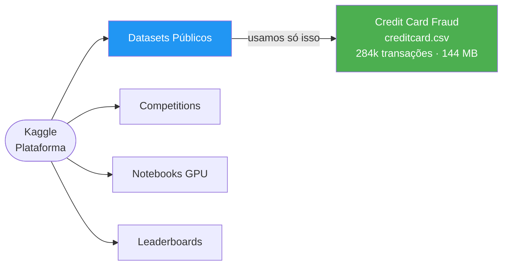

**Como acessar**: conta gratuita em kaggle.com → Download direto ou via CLI. Não é necessário participar de nenhuma competição.

---

## Por que este dataset?

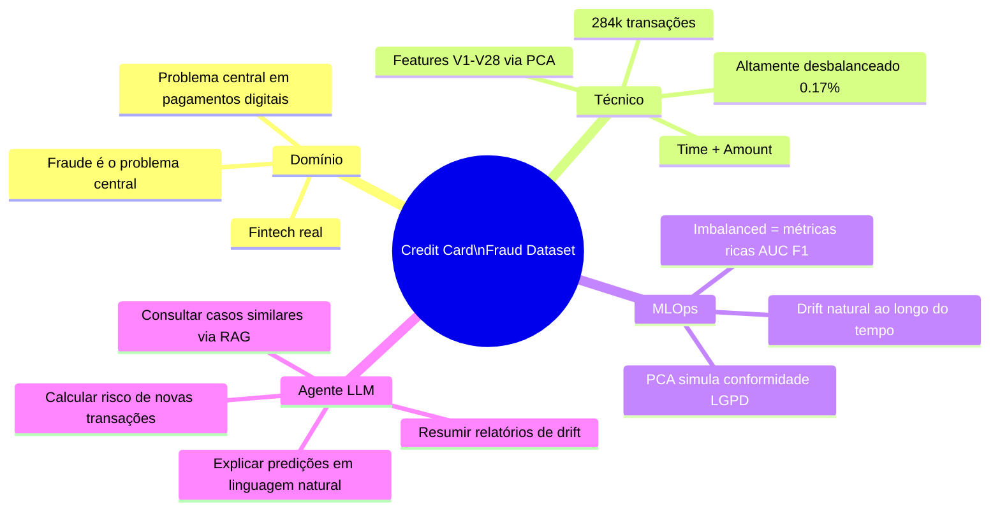

---

## O que vamos construir

Um sistema MLOps completo de detecção de fraude com quatro camadas integradas, cobrindo todas as fases do curso.

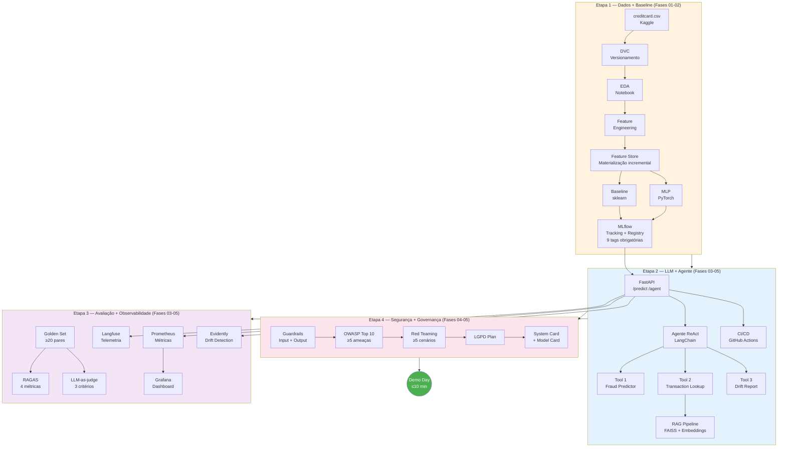

---

## Como vamos ingerir os dados

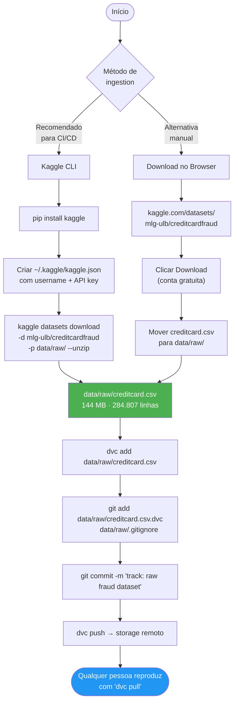

### Por que DVC e não Git?

| O que **não** fazer | O que **fazemos** |
|---|---|
| `git add creditcard.csv` (144 MB no repo) | `dvc add creditcard.csv` (só o hash no Git) |
| Dados diferentes em cada máquina | `dvc pull` reproduz exatamente os mesmos dados |
| Impossível auditar versão dos dados | `.dvc` file registra hash + metadata |
| Falha em CI por falta de dados | Pipeline DVC como etapa do workflow |

---

## Plano de 4 dias

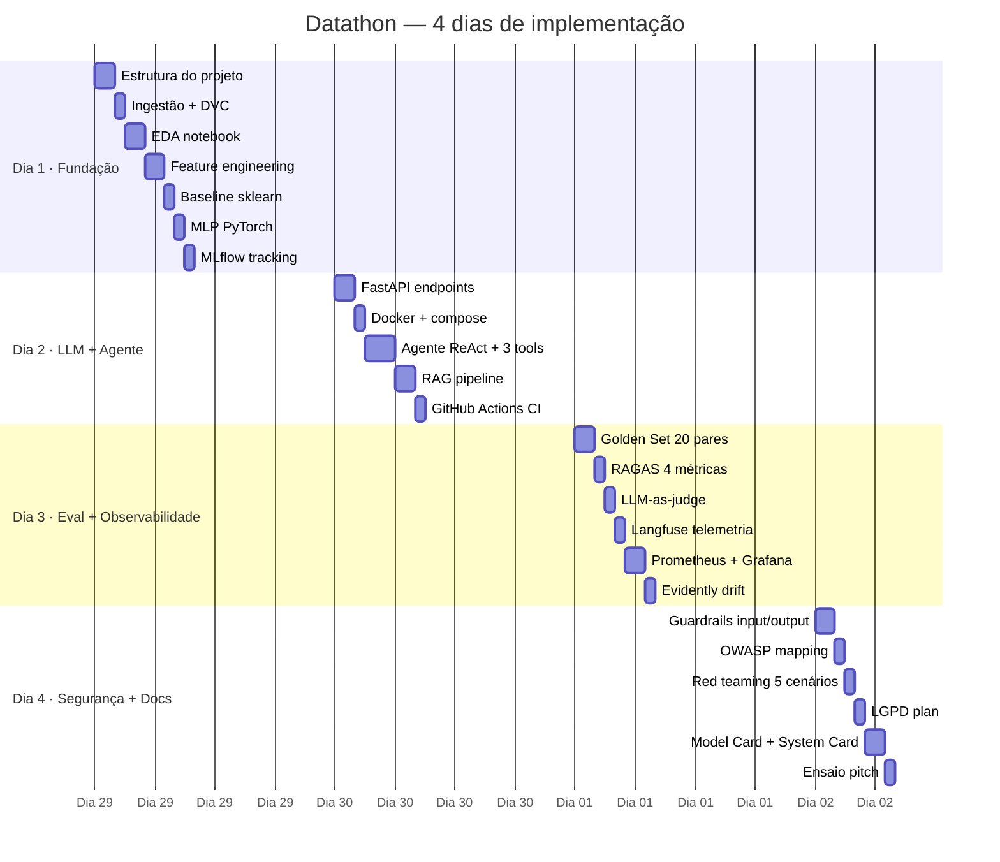

---

### Dia 1 — Fundação (Fases 01–02)

**Objetivo**: dados versionados, EDA documentada, baseline treinado e rastreado no MLflow.

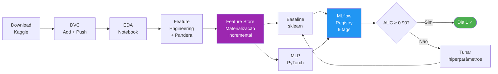

| Tarefa | Entregável |
|---|---|
| Estrutura do projeto | `pyproject.toml`, `Makefile`, `.env.example`, pastas |
| Ingestão + DVC | `data/raw/creditcard.csv.dvc` commitado |
| EDA (`notebooks/01_eda.ipynb`) | Distribuição de classes, correlações, análise temporal |
| Feature engineering (`src/features/`) | Scaling, features derivadas, schema Pandera validado |
| **Feature Store** (`src/features/feature_store.py`) | Materialização incremental via upsert — **nunca full-flush**; features compartilhadas entre baseline e MLP |
| **Dados sintéticos** (`tests/conftest.py`) | Faker + fixtures com distribuição realista de fraude — usado em todos os testes, nunca dados reais |
| Baseline sklearn (`src/models/baseline.py`) | LogisticRegression + RandomForest |
| MLP PyTorch (`src/models/mlp.py`) | Rede simples, BCE loss, class weights para desbalanceamento |
| **MLflow Registry** (`src/models/train.py`) | 9 tags obrigatórias: `model_name`, `model_version`, `model_type`, `training_data_version`, `metrics`, `owner`, `risk_level`, `fairness_checked`, `git_sha` |
| Testes (`tests/test_features.py`, `tests/test_models.py`) | pytest com dados sintéticos, cobertura ≥ 60% |

**Schema obrigatório de tags no MLflow Registry:**
```python
required_tags = {
    "model_name":              str,   # ex: "fraud_detector_rf"
    "model_version":           str,   # ex: "1.2.0"
    "model_type":              str,   # "classification"
    "training_data_version":   str,   # hash DVC do creditcard.csv
    "metrics":                 dict,  # {"auc": 0.95, "f1": 0.88}
    "owner":                   str,   # email do responsável
    "risk_level":              str,   # "high" (decisão financeira)
    "fairness_checked":        bool,  # True após análise fairlearn
    "git_sha":                 str,   # commit hash
}
```

**Critério de saída**: `make train` roda do zero, todas as 9 tags aparecem no MLflow Registry.

---

### Dia 2 — LLM + Agente (Fases 03 + 05)

**Objetivo**: agente ReAct funcional, servido via FastAPI, com CI/CD rodando.

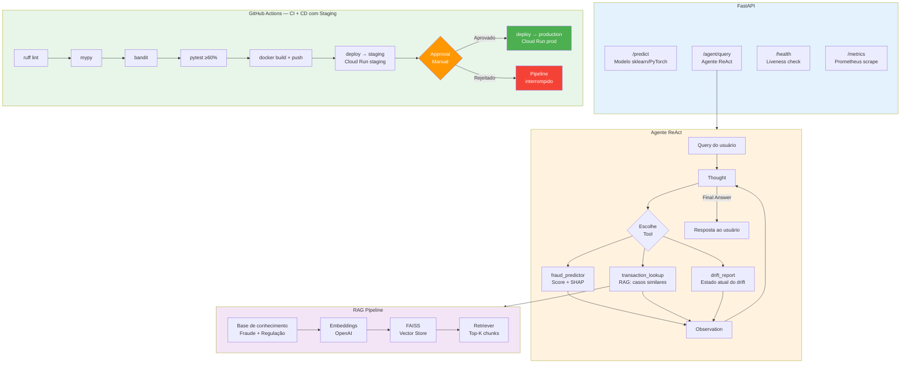

| Tarefa | Entregável |
|---|---|
| FastAPI (`src/serving/app.py`) | Endpoints `/predict`, `/agent/query`, `/health`, `/metrics` |
| Dockerfile + docker-compose | serving + MLflow + Prometheus + Grafana + Langfuse |
| Agente ReAct (`src/agent/react_agent.py`) | LangChain/LangGraph, max_iterations=10 |
| Tool 1: `fraud_predictor` | Retorna score + explicação SHAP em linguagem natural |
| Tool 2: `transaction_lookup` | RAG sobre base de casos de fraude documentados |
| Tool 3: `drift_report` | Lê relatório Evidently e resume o estado do drift |
| RAG pipeline (`src/agent/rag_pipeline.py`) | FAISS local, embeddings OpenAI |
| **CI/CD com staging** (`.github/workflows/`) | `ci.yml`: lint → mypy → bandit → pytest → docker build · `cd.yml`: deploy staging → **approval manual** → deploy production |
| **Ambiente staging** | Cloud Run service separado (`fraud-api-staging`) — recebe todo merge em `main` antes da produção |
| **Quantização do LLM** | Benchmark: gpt-4o-mini (API) vs. llama3.2:3b-q4\_K\_M (Ollama local) — latência e qualidade documentadas |
| **Benchmark ≥ 3 configurações** (`evaluation/benchmark_configs.py`) | Config A: gpt-4o-mini + temp 0.0 · Config B: gpt-4o-mini + temp 0.3 + chunk size 512 · Config C: Ollama quantizado |

**Critério de saída**: merge em `main` dispara staging automaticamente; produção só recebe após approval manual no GitHub.

---

### Dia 3 — Avaliação + Observabilidade (Fases 03–05)

**Objetivo**: métricas de qualidade calculadas, dashboard ao vivo, drift detectado.

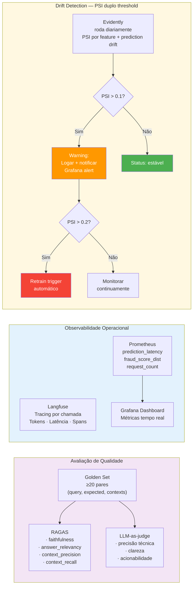

| Tarefa | Entregável |
|---|---|
| Golden Set (`data/golden_set/`) | ≥ 20 pares query/resposta sobre fraude e o sistema |
| RAGAS (`evaluation/ragas_eval.py`) | 4 métricas: faithfulness, answer_relevancy, context_precision, context_recall |
| LLM-as-judge (`evaluation/llm_judge.py`) | 3 critérios: **precisão técnica** · **clareza para não-especialistas** · **impacto na decisão de negócio** (critério de negócio obrigatório pela rubrica) |
| Langfuse | Tracing completo de cada chamada do agente (tokens, latência, spans) |
| Prometheus (`src/monitoring/metrics.py`) | 3 métricas customizadas expostas em `/metrics` |
| Grafana | Dashboard com ≥ 4 painéis — Langfuse + Prometheus integrados, funcionando **simultaneamente durante a demo**; **alertas automáticos** configurados por degradação de AUC e PSI |
| **Evidently com PSI duplo** (`src/monitoring/drift.py`) | PSI > 0.1 → warning + Grafana alert · PSI > 0.2 → retrain trigger automático · métricas de drift logadas no MLflow |

**Critério de saída**: Grafana E Langfuse mostram dados ao vivo ao mesmo tempo; Evidently detecta os dois níveis de PSI e dispara alertas corretos.

---

### Dia 4 — Segurança + Governança (Fases 04–05)

**Objetivo**: sistema defensável perante banca técnica e de negócio.

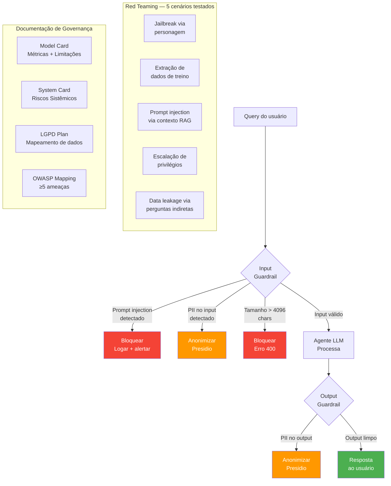

| Tarefa | Entregável |
|---|---|
| Input guardrail (`src/security/guardrails.py`) | Detecta injection, limita tamanho, anonimiza PII |
| Output guardrail | Presidio remove CPF/email/telefone do output |
| OWASP mapping (`docs/OWASP_MAPPING.md`) | ≥ 5 ameaças do OWASP Top 10 LLM com mitigação |
| Red teaming (`docs/RED_TEAM_REPORT.md`) | ≥ 5 cenários adversariais documentados e testados |
| LGPD plan (`docs/LGPD_PLAN.md`) | Base legal, dados coletados, direitos dos titulares |
| Model Card (`docs/MODEL_CARD.md`) | Métricas, limitações, viés, uso pretendido |
| System Card (`docs/SYSTEM_CARD.md`) | Arquitetura, riscos sistêmicos, responsáveis |
| Fairness check | Viés por segmento (valor, horário) via `fairlearn` |
| Ensaio do pitch | ≤ 10 min com timer, backup de slides |

**Critério de saída**: checklist completo, `make demo` sobe tudo do zero.

---

## Estrutura de pastas

```
datathon/
├── .github/
│   └── workflows/
│       ├── ci.yml                   # lint → type-check → test → docker build
│       └── cd.yml                   # deploy staging → approval gate → deploy production
├── data/
│   ├── raw/                         # creditcard.csv (DVC, não no Git)
│   ├── processed/                   # features processadas (DVC)
│   └── golden_set/                  # ≥20 pares para avaliação RAG
├── src/
│   ├── features/
│   │   ├── feature_engineering.py
│   │   └── feature_store.py          # materialização incremental (upsert, nunca full-flush)
│   ├── models/
│   │   ├── baseline.py              # sklearn (LogReg, RandomForest)
│   │   ├── mlp.py                   # PyTorch MLP
│   │   └── train.py                 # pipeline MLflow
│   ├── agent/
│   │   ├── react_agent.py           # agente ReAct (LangChain)
│   │   ├── tools.py                 # ≥3 tools customizadas
│   │   └── rag_pipeline.py          # FAISS + embeddings
│   ├── serving/
│   │   ├── app.py                   # FastAPI
│   │   └── Dockerfile
│   ├── monitoring/
│   │   ├── drift.py                 # Evidently
│   │   └── metrics.py               # Prometheus
│   └── security/
│       ├── guardrails.py            # input + output
│       └── pii_detection.py         # Presidio
├── tests/
│   ├── conftest.py
│   ├── test_features.py
│   ├── test_models.py
│   ├── test_agent.py
│   ├── test_api.py
│   └── test_guardrails.py
├── evaluation/
│   ├── ragas_eval.py
│   ├── llm_judge.py
│   └── golden_set_builder.py
├── notebooks/
│   └── 01_eda.ipynb
├── docs/
│   ├── MODEL_CARD.md
│   ├── SYSTEM_CARD.md
│   ├── LGPD_PLAN.md
│   ├── OWASP_MAPPING.md
│   └── RED_TEAM_REPORT.md
├── configs/
│   ├── model_config.yaml
│   └── monitoring_config.yaml
├── docker-compose.yml
├── dvc.yaml
├── pyproject.toml
├── Makefile
├── .env.example
└── README.md
```

---

## Stack tecnológica

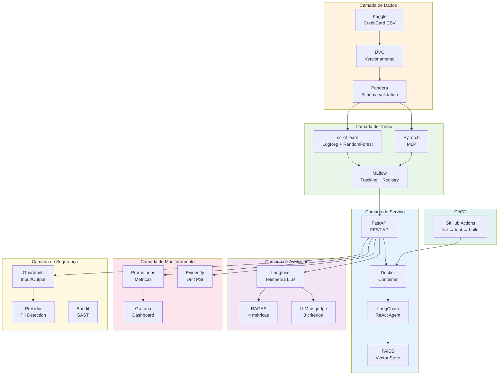

| Camada | Ferramenta | Justificativa |
|---|---|---|
| Dados | DVC + Kaggle CLI | Reprodutível, sem dado no Git |
| Validação | Pandera | Schema contracts em feature engineering |
| **Feature Store** | Parquet + upsert incremental | MLOps Maturity Level 2 — sem full-flush |
| **Dados sintéticos** | Faker + fixtures pytest | Dev/test sem dados reais; GAP 08 da rubrica |
| Baseline | scikit-learn + PyTorch | Rubrica exige ambos explicitamente |
| Tracking | MLflow + Registry (9 tags) | Padrão da rubrica com schema obrigatório |
| Serving | FastAPI + Docker | Leve, tipado, fácil de testar |
| **CI/CD com staging** | GitHub Actions + Environments | lint → test → staging → **approval** → production |
| Agente | LangChain + LangGraph | Suporte nativo a ReAct e tools |
| LLM | OpenAI API (gpt-4o-mini) | Custo baixo, sem GPU local |
| RAG | FAISS + OpenAI Embeddings | Sem servidor externo, funciona local |
| Avaliação | RAGAS + LLM-as-judge | Rubrica exige ambos |
| Telemetria | Langfuse | LLMOps nativo, open-source |
| Monitoramento | Prometheus + Grafana + **alertas** | Stack padrão da Fase 03 com alertas automáticos |
| Drift | Evidently + PSI duplo (0.1/0.2) | Padrão da Fase 04 com dois níveis de threshold |
| Segurança | Presidio + regex | PII detection + injection |

---

## Critérios de avaliação e como atendemos cada um

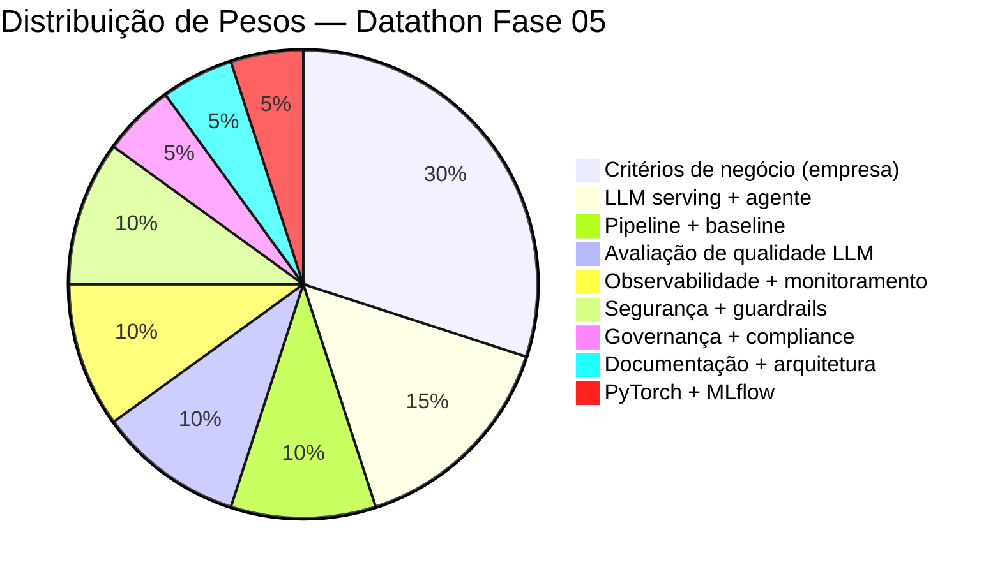

| Critério | Peso | Como atendemos |
|---|---|---|
| Critérios de negócio | 30% | Domínio fintech real, métricas de negócio no Grafana (taxa de fraude, valor em risco), demo orientado ao impacto |
| LLM serving + agente | 15% | FastAPI + ReAct com 3 tools + RAG funcional + CI/CD |
| Pipeline + baseline | 10% | DVC + MLflow + sklearn + PyTorch, `make train` reprodutível |
| Qualidade LLM | 10% | RAGAS 4 métricas + LLM-as-judge 3 critérios + golden set 20 pares |
| Observabilidade | 10% | Grafana + Langfuse + Evidently drift + alertas PSI |
| Segurança | 10% | Presidio + guardrails + OWASP ≥5 + red teaming ≥5 |
| Governança | 5% | LGPD + fairness + explicabilidade SHAP + System Card |
| Documentação | 5% | Model Card + System Card + README completo + ADRs |
| PyTorch + MLflow | 5% | MLP treinado + MLflow com tags obrigatórias |

---

## Deployment — Onde e como o sistema fica disponível online

### Onde cada peça roda

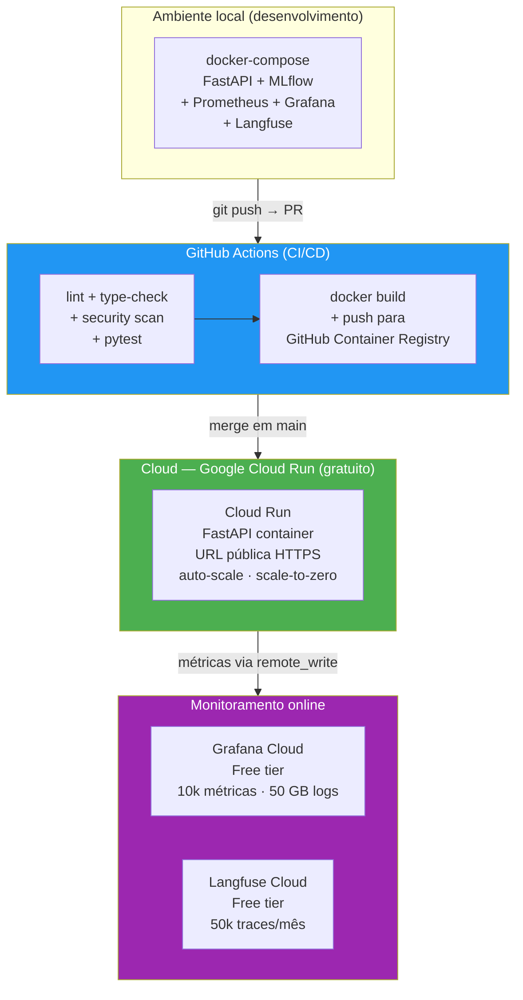

### Por que Google Cloud Run?

| Critério | Cloud Run | Alternativas descartadas |
|---|---|---|
| **Custo** | Gratuito: 2M requests/mês, 360k GB-s de compute | AWS EC2 (sempre ligado = caro), Heroku (sem free tier) |
| **Deploy** | `gcloud run deploy` com uma linha, ou automático via GitHub Actions | SageMaker (complexo demais para o prazo) |
| **Docker-native** | Recebe qualquer imagem Docker diretamente | Render (mais lento no cold start) |
| **HTTPS automático** | URL pública com SSL já configurado | VPS manual (precisa configurar nginx + certbot) |
| **Scale-to-zero** | Não cobra quando não há requisições | VM sempre ligada cobra 24/7 |

### Fluxo completo de deploy

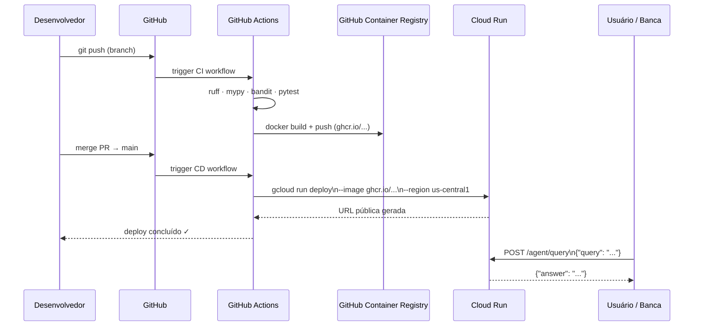

### URLs que a banca vai acessar

| Endpoint | URL (exemplo) | O que faz |
|---|---|---|
| `/predict` | `https://fraud-api-xxx.run.app/predict` | Score de fraude para uma transação |
| `/agent/query` | `https://fraud-api-xxx.run.app/agent/query` | Agente ReAct responde em linguagem natural |
| `/health` | `https://fraud-api-xxx.run.app/health` | Liveness check |
| `/docs` | `https://fraud-api-xxx.run.app/docs` | Swagger UI automático do FastAPI |
| Grafana | `https://xxx.grafana.net` | Dashboard de monitoramento |
| Langfuse | `https://cloud.langfuse.com` | Traces do agente |

---

## Atualização do modelo — Com que frequência retreinamos?

### Estratégia de retraining

Usamos três camadas de trigger, do mais simples ao mais sofisticado:

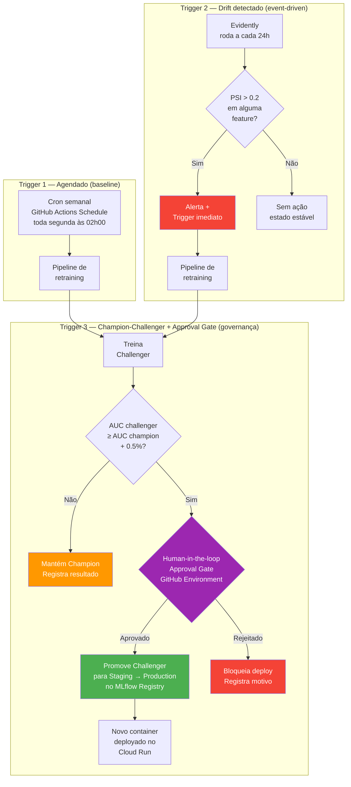

### Cadência de operações

| Operação | Frequência | Trigger | Responsável |
|---|---|---|---|
| **Inferência** | Tempo real | Requisição ao `/predict` | Cloud Run |
| **Drift check** | Diário (02h00) | Cron GitHub Actions | Evidently |
| **Warning PSI** | Quando PSI > 0.1 | Drift check diário | Grafana alert |
| **Retraining agendado** | Semanal (seg 02h00) | Cron GitHub Actions | Pipeline DVC |
| **Retraining emergencial** | Quando PSI > 0.2 | Drift detectado | Pipeline DVC |
| **Champion-challenger** | A cada retraining | Pós-treino automático | MLflow Registry |
| **Human-in-the-loop gate** | Quando challenger vence | Pós-challenger evaluation | **Aprovação manual** no GitHub |
| **Deploy de novo modelo** | Após aprovação humana | GitHub Environment approval | GitHub Actions |

### Por que semanal como baseline?

O dataset de fraude tem padrões que mudam com o tempo (novos vetores de ataque, sazonalidade). Semanal é:
- Rápido o suficiente para capturar mudanças relevantes
- Lento o suficiente para não gastar compute desnecessário
- Comum em sistemas de detecção de fraude reais

Para o **Demo Day**, vamos simular o retraining manualmente com `make train` para demonstrar o processo ao vivo.

### Ciclo de vida de uma versão do modelo

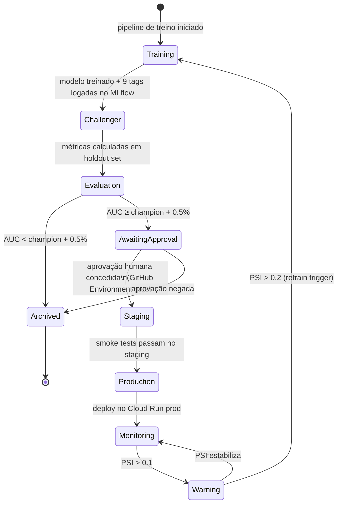

---

## Checklist de entrega

### Etapa 1 — Dados + Baseline
- [ ] EDA documentada com insights sobre o padrão de fraude
- [ ] Baseline treinado, métricas reportadas no MLflow (AUC, F1, precision, recall)
- [ ] Pipeline versionado (DVC + Docker) e reprodutível com `make train`
- [ ] **MLflow Registry com 9 tags obrigatórias** (model_name, model_version, model_type, training_data_version, metrics, owner, risk_level, fairness_checked, git_sha)
- [ ] **Feature Store com materialização incremental** (upsert — nunca full-flush)
- [ ] **Dados sintéticos com Faker** em `tests/conftest.py` — todos os testes usam fixtures, nunca dados reais
- [ ] Métricas de negócio mapeadas (ex: valor total em risco, taxa de detecção)
- [ ] `pyproject.toml` com todas as dependências e constraints

### Etapa 2 — LLM + Agente
- [ ] LLM servido via FastAPI com endpoint documentado
- [ ] **Quantização aplicada e documentada** (gpt-4o-mini via API + Ollama GGUF local comparados)
- [ ] Agente ReAct funcional com ≥ 3 tools relevantes ao domínio
- [ ] RAG retornando contexto de casos de fraude similares
- [ ] **CI/CD com staging**: merge → staging automático → **approval manual** → production
- [ ] **Benchmark documentado com exatamente 3 configurações**: Config A (temp 0.0), Config B (temp 0.3 + chunk 512), Config C (Ollama quantizado)

### Etapa 3 — Avaliação + Observabilidade
- [ ] Golden set com ≥ 20 pares relevantes ao domínio de fraude
- [ ] RAGAS: 4 métricas calculadas e reportadas
- [ ] **LLM-as-judge com ≥ 3 critérios incluindo critério de negócio** (impacto na decisão do analista)
- [ ] **Langfuse + Grafana funcionando simultaneamente** (end-to-end, não só existindo)
- [ ] **Drift com PSI duplo**: PSI > 0.1 = warning + Grafana alert · PSI > 0.2 = retrain trigger automático
- [ ] **Alertas automáticos** configurados no Grafana por degradação de AUC e PSI

### Etapa 4 — Segurança + Governança
- [ ] OWASP mapping com ≥ 5 ameaças e mitigações
- [ ] Guardrails de input e output funcionais e testados
- [ ] ≥ 5 cenários adversariais testados e documentados
- [ ] Plano LGPD aplicado ao dataset e ao sistema
- [ ] Explicabilidade SHAP e fairness documentados
- [ ] System Card e Model Card completos
- [ ] **Human-in-the-loop approval gate** configurado no GitHub Environment antes de todo deploy em produção

### Demo Day
- [ ] Pitch ≤ 10 min: Problema → Abordagem → Demo → Resultados → Impacto
- [ ] Ensaio com timer realizado
- [ ] Backup: slides offline caso a demo falhe
- [ ] Preparado para Q&A técnico (RAGAS scores, PSI, AUC) e de negócio (impacto financeiro)

---

## Comandos principais

```bash
make setup        # cria venv e instala todas as dependências
make data         # dvc pull (ou instrução de download manual)
make train        # treina baseline + MLP, loga no MLflow
make serve        # docker-compose up (FastAPI + MLflow + Prometheus + Grafana + Langfuse)
make test         # pytest com cobertura ≥ 60%
make eval         # roda RAGAS + LLM-as-judge no golden set
make drift        # gera relatório Evidently (train vs. predições recentes)
make demo         # setup completo para Demo Day do zero
```
