# Fraud Detection MLOps System

> FIAP Pós-Tech MLET — Datathon Fase 05 | Integrative Project (Phases 01–05)

MLOps system for credit card fraud detection — from data ingestion to LLM-powered agent with full observability, security, and governance.

## Quick start

```bash
cp .env.example .env          # fill in your keys
make setup                    # install dependencies
make data                     # download dataset (requires Kaggle account)
make train                    # train models, log to MLflow
docker compose up -d          # start all services (Prometheus, Grafana, Langfuse, LocalStack)
make localstack-init          # create S3 bucket in LocalStack
make data-push                # version feature store → LocalStack S3 via DVC
make test                     # run test suite
```

## Services

| Service | URL | Credentials |
|---|---|---|
| API | http://localhost:8000/docs | — |
| MLflow | http://localhost:5000 | — |
| Grafana | http://localhost:3000 | admin / datathon |
| Langfuse | http://localhost:3001 | — |
| Prometheus | http://localhost:9090 | — |
| LocalStack (S3) | http://localhost:4566 | key=test / secret=test |

> **LocalStack persistence:** the `localstack_data` Docker volume survives `docker compose stop/up` but is wiped by `docker compose down -v`. On a fresh machine, re-run `make localstack-init && make data-push`. The feature store can always be regenerated from scratch with `make train`.

## Architecture

Full architecture details and component descriptions are in [docs/ARCHITECTURE.md](docs/ARCHITECTURE.md).

```mermaid
flowchart TD
    %% ── Color styles ──────────────────────────────────────────────────────
    classDef data        fill:#1e3a5f,stroke:#4a90d9,color:#e8f4fd
    classDef training    fill:#1a3d2b,stroke:#4caf50,color:#e8f5e9
    classDef serving     fill:#3d1a1a,stroke:#e57373,color:#fce4e4
    classDef agent       fill:#2d1f4e,stroke:#9c6fd6,color:#ede7f6
    classDef monitoring  fill:#3d2e00,stroke:#ffb300,color:#fff8e1
    classDef cicd        fill:#1c2b3a,stroke:#546e7a,color:#eceff1

    subgraph DATA ["Data Ingestion & Feature Engineering"]
        direction TB
        CSV["creditcard.csv<br/>(Kaggle / local)"]:::data
        DVC["DVC<br/>(data versioning + md5 hash)"]:::data
        FE["compute_features()<br/>(feature_engineering.py)"]:::data
        FS["Feature Store<br/>(feature_store.parquet)"]:::data
        CSV --> DVC --> FE --> FS
    end

    subgraph TRAINING ["Training Pipeline  (train.py)"]
        direction TB
        LOAD["Load raw CSV<br/>+ DVC hash tag"]:::training
        FEAT["Feature Engineering<br/>+ upsert_features()"]:::training
        SPLIT["Train / Test split<br/>(get_splits)"]:::training

        subgraph MODELS ["Model Training"]
            direction LR
            LR_MODEL["Logistic Regression<br/>(fraud_detector_lr)"]:::training
            RF_MODEL["Random Forest<br/>(fraud_detector_rf)"]:::training
            MLP_MODEL["PyTorch MLP<br/>(fraud_detector_mlp)<br/>[optional]"]:::training
        end

        MLFLOW_LOG["MLflow: log_params<br/>log_metrics + log_model<br/>(git_sha, dvc_hash, risk tags)"]:::training

        subgraph CHAMP ["Champion-Challenger"]
            direction TB
            GET_CHAMP["Get @Production AUC<br/>(MLflow Registry)"]:::training
            DELTA["AUC delta >= 0.005?"]:::training
            PROMOTE["Set alias @Production<br/>(latest version)"]:::training
            REJECT["Challenger rejected<br/>(delta insufficient)"]:::training
            GET_CHAMP --> DELTA
            DELTA -->|yes| PROMOTE
            DELTA -->|no| REJECT
        end

        LOAD --> FEAT --> SPLIT --> MODELS --> MLFLOW_LOG --> CHAMP
    end

    subgraph REGISTRY ["MLflow Model Registry"]
        direction TB
        REG_RF["fraud_detector_rf<br/>@Production alias"]:::training
    end

    subgraph SERVING ["Serving  (FastAPI — app.py)"]
        direction TB
        LOAD_MODEL["lifespan: load_model()<br/>from models:/fraud_detector_rf@Production"]:::serving
        PREDICT_EP["POST /predict"]:::serving

        subgraph PREDICT_FLOW ["Prediction Flow"]
            direction TB
            P_FEAT["compute_features()"]:::serving
            P_PROBA["model.predict_proba()"]:::serving
            P_THRESH["score >= 0.5?"]:::serving
            P_RESP["PredictResponse<br/>{fraud_score, label}"]:::serving
            P_FEAT --> P_PROBA --> P_THRESH --> P_RESP
        end

        PROM_METRICS["/metrics/<br/>(Prometheus ASGI app)"]:::monitoring

        LOAD_MODEL --> PREDICT_EP
        PREDICT_EP --> PREDICT_FLOW
    end

    subgraph AGENT ["Agent Flow  (react_agent.py + rag_pipeline.py)"]
        direction TB
        IN_GUARD["InputGuardrail<br/>(validate + sanitize)"]:::agent
        REACT["ReAct Agent<br/>(LangGraph)"]:::agent

        subgraph TOOLS ["Agent Tools"]
            direction LR
            TOOL_PRED["fraud_predictor"]:::agent
            TOOL_LOOK["transaction_lookup"]:::agent
            TOOL_DRIFT["drift_report"]:::agent
        end

        subgraph RAG ["RAG Pipeline"]
            direction TB
            FAISS_IDX["FAISS index<br/>(fraud knowledge base)"]:::agent
            RETRIEVE["similarity_search(k=3)"]:::agent
            FAISS_IDX --> RETRIEVE
        end

        OUT_GUARD["OutputGuardrail<br/>(sanitize response)"]:::agent
        LANGFUSE["Langfuse<br/>(LLM telemetry)"]:::agent

        IN_GUARD --> REACT
        REACT <--> TOOLS
        REACT --> RAG
        REACT --> OUT_GUARD
        REACT -.->|callbacks| LANGFUSE
    end

    subgraph MONITORING ["Monitoring Stack"]
        direction TB
        PROM["Prometheus :9090<br/>(scrapes /metrics/ every 15s)"]:::monitoring
        GRAFANA["Grafana :3000<br/>(11 panels, 4 alerts)"]:::monitoring
        PROM --> GRAFANA
    end

    subgraph DRIFT ["Drift Detection  (drift.py)"]
        direction TB
        EVIDENTLY["Evidently DataDriftPreset"]:::monitoring
        PSI["compute_psi() per feature<br/>(Amount_scaled, V14, Hour, Amount_log1p)"]:::monitoring
        PSI_DECISION{"PSI thresholds"}:::monitoring
        WARN_LOG["WARNING log<br/>(PSI > 0.1)"]:::monitoring
        RETRAIN_FLAG["retrain_needed = true<br/>(PSI > 0.2)"]:::monitoring
        DRIFT_JSON["drift_status.json"]:::monitoring

        EVIDENTLY --> PSI --> PSI_DECISION
        PSI_DECISION -->|"> 0.1"| WARN_LOG
        PSI_DECISION -->|"> 0.2"| RETRAIN_FLAG
        RETRAIN_FLAG --> DRIFT_JSON
    end

    subgraph RETRAIN_LOOP ["Retraining Loop  (retrain.yml)"]
        direction TB
        SCHEDULE["Cron: daily 02:00 UTC<br/>or workflow_dispatch"]:::cicd
        DRIFT_CHECK["Job: drift-check"]:::cicd
        HUMAN_GATE["Environment: production<br/>(manual approval)"]:::cicd
        RETRAIN_JOB["Job: retrain<br/>(champion-challenger)"]:::cicd

        SCHEDULE --> DRIFT_CHECK --> HUMAN_GATE -->|approved| RETRAIN_JOB
    end

    subgraph CICD ["CI/CD Pipelines"]
        direction LR
        subgraph CI_PIPE ["CI  (ci.yml)"]
            direction TB
            LINT["ruff + mypy + bandit"]:::cicd
            PYTEST["pytest --cov >= 60%"]:::cicd
            DOCKER_BUILD["Docker build"]:::cicd
            LINT --> PYTEST --> DOCKER_BUILD
        end

        subgraph CD_PIPE ["CD  (cd.yml) — push to main"]
            direction TB
            DOCKER_PUSH["Build & push<br/>fraud-api → GHCR"]:::cicd
        end
    end

    %% Cross-subgraph connections
    FS -->|features loaded| LOAD
    PROMOTE --> REG_RF
    REG_RF --> LOAD_MODEL
    PREDICT_FLOW -->|prediction_latency<br/>fraud_score<br/>request_counter| PROM_METRICS
    PROM_METRICS --> PROM
    AGENT_EP["POST /agent/query"]:::serving --> IN_GUARD
    OUT_GUARD --> AGENT_EP
    AGENT_EP -->|agent_latency<br/>request_counter| PROM_METRICS
    DRIFT_JSON -->|read by drift_report tool| TOOL_DRIFT
    PSI -.->|psi_gauge| PROM
    DRIFT_JSON --> DRIFT_CHECK
    RETRAIN_JOB -->|new Registry version| REGISTRY
    CI_PIPE -->|on push to main| CD_PIPE
```


