# ML Infrastructure Architecture

This document describes the complete ML infrastructure for the Fraud Detection MLOps system (FIAP MLET Datathon Phase 05).

## Full System Flowchart

```mermaid
flowchart TD
    %% ── Color styles ──────────────────────────────────────────────────────
    classDef data        fill:#1e3a5f,stroke:#4a90d9,color:#e8f4fd
    classDef training    fill:#1a3d2b,stroke:#4caf50,color:#e8f5e9
    classDef serving     fill:#3d1a1a,stroke:#e57373,color:#fce4e4
    classDef agent       fill:#2d1f4e,stroke:#9c6fd6,color:#ede7f6
    classDef monitoring  fill:#3d2e00,stroke:#ffb300,color:#fff8e1
    classDef cicd        fill:#1c2b3a,stroke:#546e7a,color:#eceff1

    %% ════════════════════════════════════════════════════════════════════
    subgraph DATA ["Data Ingestion & Feature Engineering"]
        direction TB
        CSV["creditcard.csv\n(Kaggle / local)"]:::data
        DVC["DVC\n(data versioning + md5 hash)"]:::data
        FE["compute_features()\n(feature_engineering.py)"]:::data
        FS["Feature Store\n(feature_store.parquet)"]:::data
        CSV --> DVC --> FE --> FS
    end

    %% ════════════════════════════════════════════════════════════════════
    subgraph TRAINING ["Training Pipeline  (train.py)"]
        direction TB
        LOAD["Load raw CSV\n+ DVC hash tag"]:::training
        FEAT["Feature Engineering\n+ upsert_features()"]:::training
        SPLIT["Train / Test split\n(get_splits)"]:::training

        subgraph MODELS ["Model Training"]
            direction LR
            LR_MODEL["Logistic Regression\n(fraud_detector_lr)"]:::training
            RF_MODEL["Random Forest\n(fraud_detector_rf)"]:::training
            MLP_MODEL["PyTorch MLP\n(fraud_detector_mlp)\n[optional — torch required]"]:::training
        end

        MLFLOW_LOG["MLflow: log_params\nlog_metrics + log_model\n(git_sha, dvc_hash, risk tags)"]:::training

        subgraph CHAMP ["Champion-Challenger"]
            direction TB
            GET_CHAMP["Get @Production AUC\n(MLflow Registry)"]:::training
            DELTA["AUC delta >= 0.005?"]:::training
            PROMOTE["Set alias @Production\n(latest version)"]:::training
            REJECT["Challenger rejected\n(delta insufficient)"]:::training
            GET_CHAMP --> DELTA
            DELTA -->|yes| PROMOTE
            DELTA -->|no| REJECT
        end

        LOAD --> FEAT --> SPLIT --> MODELS --> MLFLOW_LOG --> CHAMP
    end

    %% ════════════════════════════════════════════════════════════════════
    subgraph REGISTRY ["MLflow Model Registry"]
        direction TB
        REG_LR["fraud_detector_lr\n(versions)"]:::training
        REG_RF["fraud_detector_rf\n@Production alias"]:::training
        REG_MLP["fraud_detector_mlp\n(versions)"]:::training
    end

    %% ════════════════════════════════════════════════════════════════════
    subgraph SERVING ["Serving  (FastAPI — app.py)"]
        direction TB
        LOAD_MODEL["lifespan: load_model()\nfrom models:/fraud_detector_rf@Production"]:::serving
        HEALTH["GET /health"]:::serving
        PREDICT_EP["POST /predict"]:::serving
        AGENT_EP["POST /agent/query"]:::serving

        subgraph PREDICT_FLOW ["Prediction Flow"]
            direction TB
            P_FEAT["compute_features()\n(feature_engineering)"]:::serving
            P_PROBA["model.predict_proba()"]:::serving
            P_THRESH["score >= 0.5?"]:::serving
            P_RESP["PredictResponse\n{fraud_score, label}"]:::serving
            P_FEAT --> P_PROBA --> P_THRESH --> P_RESP
        end

        PROM_METRICS["/metrics/\n(Prometheus ASGI app)"]:::monitoring

        LOAD_MODEL --> PREDICT_EP
        PREDICT_EP --> PREDICT_FLOW
    end

    %% ════════════════════════════════════════════════════════════════════
    subgraph AGENT ["Agent Flow  (react_agent.py + rag_pipeline.py)"]
        direction TB
        IN_GUARD["InputGuardrail\n(validate + sanitize\nblocks prompt injection → HTTP 400)"]:::agent
        REACT["ReAct Agent\n(LangGraph create_react_agent)"]:::agent

        subgraph LLM_BACK ["LLM Backend"]
            direction LR
            OLLAMA["ChatOllama\n(llama3.2:3b — local)"]:::agent
            OPENAI["ChatOpenAI\n(gpt-4o-mini — fallback)"]:::agent
        end

        subgraph TOOLS ["Agent Tools"]
            direction TB
            TOOL_PRED["fraud_predictor\n(calls /predict)"]:::agent
            TOOL_LOOK["transaction_lookup\n(feature store query)"]:::agent
            TOOL_DRIFT["drift_report\n(reads drift_status.json)"]:::agent
        end

        subgraph RAG ["RAG Pipeline"]
            direction TB
            FAISS_LOAD["load_index()\n(FAISS from disk)"]:::agent
            EMBED["Embeddings\n(nomic-embed-text / OpenAI)"]:::agent
            RETRIEVE["similarity_search(k=3)\n(fraud knowledge base)"]:::agent
            FAISS_LOAD --> EMBED --> RETRIEVE
        end

        OUT_GUARD["OutputGuardrail\n(sanitize response)"]:::agent
        LANGFUSE["Langfuse\n(LLM telemetry: tokens,\nlatency, tool calls)"]:::agent

        IN_GUARD --> REACT
        REACT <--> LLM_BACK
        REACT <--> TOOLS
        REACT --> RAG
        REACT --> OUT_GUARD
        REACT -.->|callbacks| LANGFUSE
    end

    %% ════════════════════════════════════════════════════════════════════
    subgraph MONITORING ["Monitoring Stack"]
        direction TB
        PROM["Prometheus\n(:9090)\nScrapes /metrics/ every 15s"]:::monitoring
        GRAFANA["Grafana\n(:3000)\n11 panels, 4 alerts"]:::monitoring
        ALERTS["Alert Rules\n(prometheus_alerts.yml)\nhigh fraud rate | high latency\ndrift warning | model AUC drop"]:::monitoring
        PROM --> GRAFANA
        PROM --> ALERTS
    end

    %% ════════════════════════════════════════════════════════════════════
    subgraph DRIFT ["Drift Detection  (drift.py)"]
        direction TB
        EVIDENTLY["Evidently DataDriftPreset\n(reference vs current)"]:::monitoring
        PSI["compute_psi()\nper feature\n(Amount_scaled, V14, Hour, Amount_log1p)"]:::monitoring
        PSI_GAUGE["drift_psi_gauge\n(Prometheus)"]:::monitoring
        DRIFT_HTML["drift_report.html\n(artifact)"]:::monitoring
        DRIFT_JSON["drift_status.json\n{retrain_needed, psi, thresholds}"]:::monitoring
        DRIFT_MFLOW["MLflow run: psi_* metrics\n+ retrain_needed flag"]:::monitoring

        PSI_DECISION{"PSI thresholds"}:::monitoring
        WARN_LOG["WARNING log\n(PSI > 0.1)"]:::monitoring
        RETRAIN_FLAG["retrain_needed = true\n(PSI > 0.2)"]:::monitoring

        EVIDENTLY --> PSI --> PSI_GAUGE
        EVIDENTLY --> DRIFT_HTML
        PSI --> PSI_DECISION
        PSI_DECISION -->|"> 0.1 warning"| WARN_LOG
        PSI_DECISION -->|"> 0.2 retrain"| RETRAIN_FLAG
        RETRAIN_FLAG --> DRIFT_JSON
        PSI --> DRIFT_MFLOW
    end

    %% ════════════════════════════════════════════════════════════════════
    subgraph RETRAIN_LOOP ["Retraining Loop  (retrain.yml)"]
        direction TB
        SCHEDULE["Cron: daily 02:00 UTC\nor workflow_dispatch"]:::cicd
        DRIFT_CHECK["Job: drift-check\npython src/monitoring/drift.py"]:::cicd
        READ_STATUS["Read drift_status.json\n→ retrain_needed output"]:::cicd
        HUMAN_GATE["Environment: production\n(manual approval required)"]:::cicd
        RETRAIN_JOB["Job: retrain\npython src/models/train.py\n(champion-challenger)"]:::cicd

        SCHEDULE --> DRIFT_CHECK --> READ_STATUS
        READ_STATUS -->|"retrain_needed == true"| HUMAN_GATE
        HUMAN_GATE -->|approved| RETRAIN_JOB
    end

    %% ════════════════════════════════════════════════════════════════════
    subgraph CICD ["CI/CD Pipelines"]
        direction LR
        subgraph CI_PIPE ["CI  (ci.yml) — on every push / PR"]
            direction TB
            LINT["ruff check"]:::cicd
            MYPY["mypy type-check"]:::cicd
            BANDIT["bandit security scan"]:::cicd
            PYTEST["pytest --cov >= 60%"]:::cicd
            DOCKER_BUILD["Docker build\n(no push)"]:::cicd
            LINT --> MYPY --> BANDIT --> PYTEST --> DOCKER_BUILD
        end

        subgraph CD_PIPE ["CD  (cd.yml) — on push to main"]
            direction TB
            GHCR_LOGIN["Login to GHCR"]:::cicd
            DOCKER_PUSH["docker build-push\nfraud-api:latest\nfraud-api:{sha}"]:::cicd
            GHCR_LOGIN --> DOCKER_PUSH
        end
    end

    %% ════════════════════════════════════════════════════════════════════
    %% Cross-subgraph connections
    FS -->|"features loaded"| LOAD
    PROMOTE --> REG_RF
    REJECT -.->|"keeps existing"| REG_RF
    REG_LR -.-> MLFLOW_LOG
    REG_RF --> LOAD_MODEL
    REG_MLP -.-> MLFLOW_LOG

    PREDICT_FLOW -->|"prediction_latency\nfraud_score\nrequest_counter"| PROM_METRICS
    PROM_METRICS --> PROM

    AGENT_EP --> IN_GUARD
    OUT_GUARD --> AGENT_EP
    AGENT_EP -->|"agent_latency\nrequest_counter"| PROM_METRICS

    DRIFT_JSON -->|"read by drift_report tool"| TOOL_DRIFT
    PSI_GAUGE --> PROM

    DRIFT_JSON --> READ_STATUS
    RETRAIN_JOB -->|"runs train.py\n→ new Registry version"| REGISTRY

    CI_PIPE -->|"on push to main"| CD_PIPE
```

## Component Summary

| Layer | Components | Key Technologies |
|---|---|---|
| Data | CSV, DVC, feature engineering, feature store | Pandas, DVC, Parquet |
| Training | train.py, baseline models, MLP | scikit-learn, PyTorch, MLflow |
| Registry | MLflow Model Registry, @Production alias | MLflow 3.x |
| Serving | FastAPI, /predict, /agent/query | FastAPI, uvicorn, Pydantic |
| Agent | ReAct agent, InputGuardrail, OutputGuardrail, RAG | LangGraph, LangChain, FAISS |
| Monitoring | Prometheus, Grafana, Evidently | Prometheus, Grafana 10, Evidently 0.7 |
| Drift | PSI computation, drift_status.json, MLflow logging | Evidently, custom PSI |
| Retraining | retrain.yml, human approval gate | GitHub Actions, environment gate |
| CI/CD | ci.yml (lint/test/build), cd.yml (GHCR push) | GitHub Actions, Docker, GHCR |
| LLM Telemetry | Langfuse traces per agent call | Langfuse 2, PostgreSQL |
